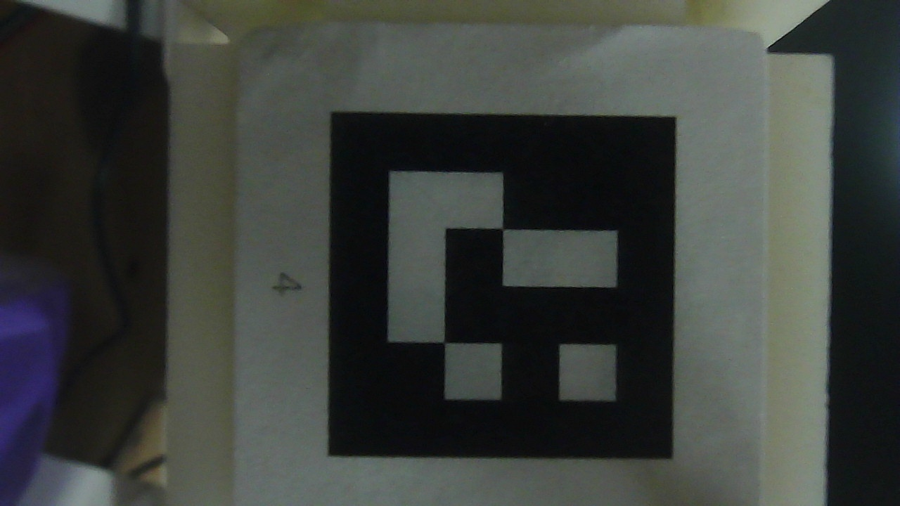
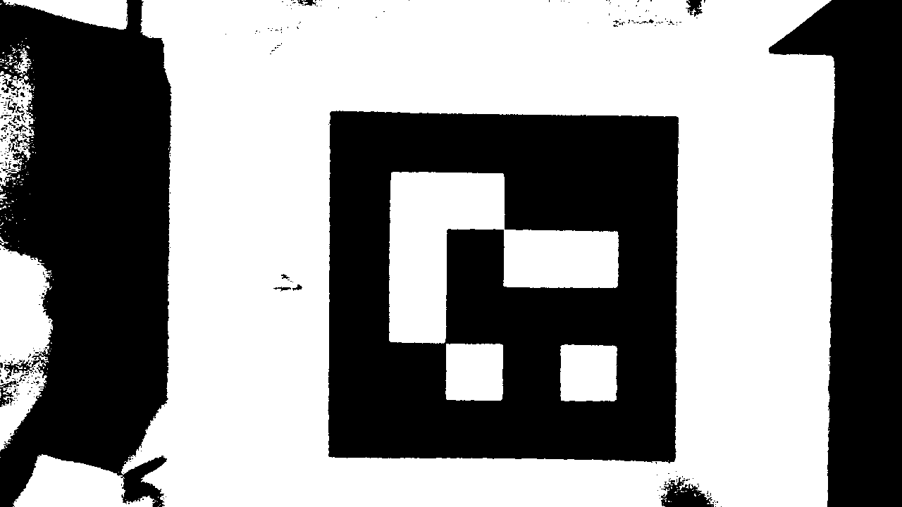
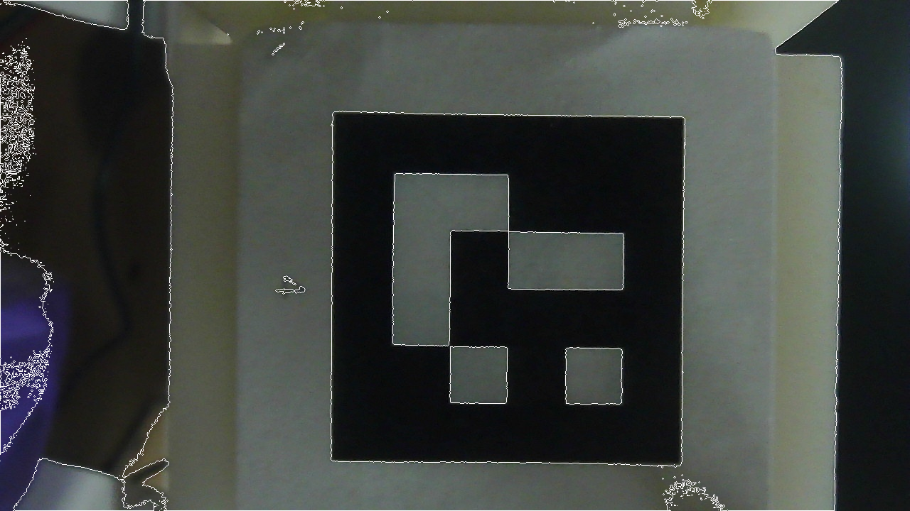
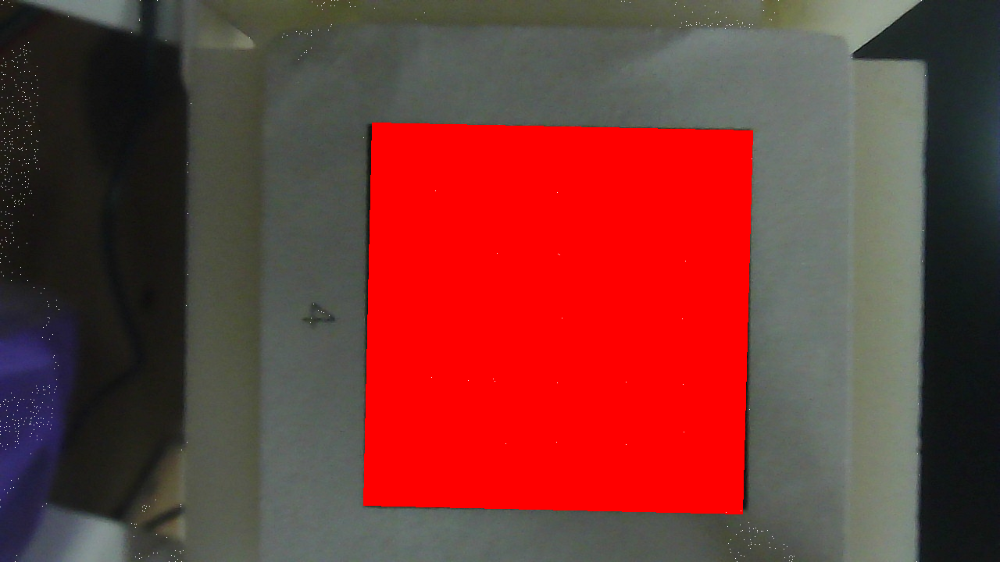
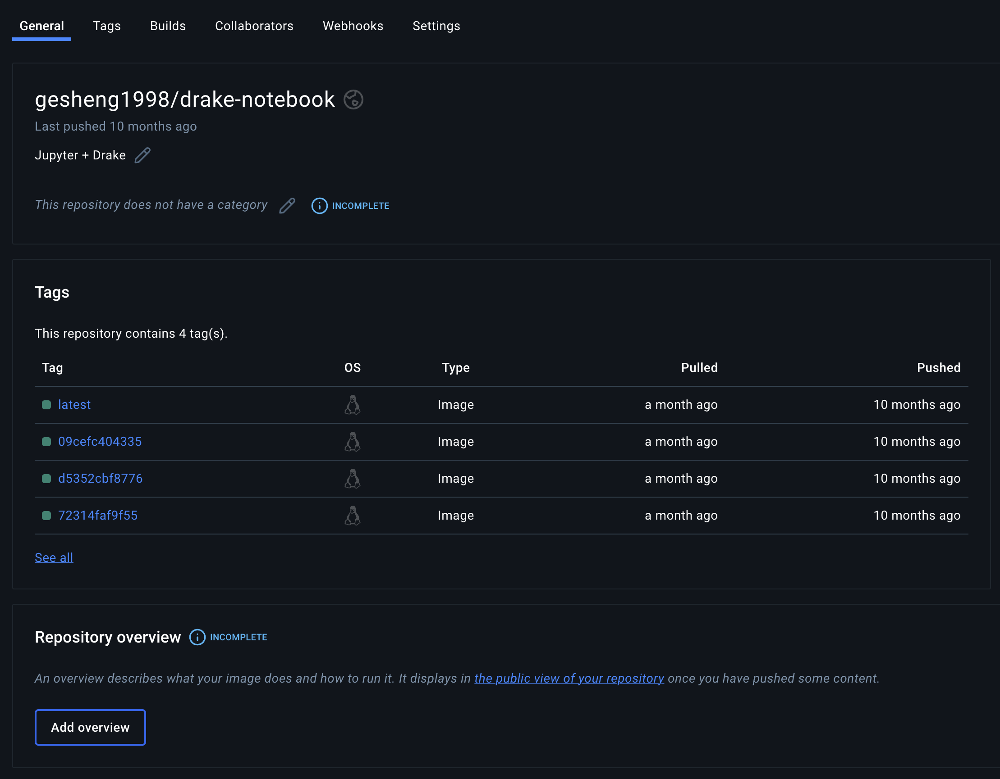

# 项目经历

## 协作机器人交互平台

<video src="b/pick.mp4" controls="controls" width="640" height="360"></video>
<video src="b/ttt.mp4" controls="controls" width="640" height="360"></video>
<video src="b/cali.mp4" controls="controls" width="640" height="360"></video>
<video src="b/grasp.mp4" controls="controls" width="640" height="360"></video>
<video src="b/sort.mp4" controls="controls" width="640" height="360"></video>

## Rust 机器人动力学运动学库
<video src="rust_ik.mov" controls="controls" width="640" height="360"></video>

## ArUco 二维码识别库

## Mesh 几何库

## DrakeNotebook docker 教学开发环境

## nurbs

## liealg

## urdf-parse  URDF 机器人模型文件解析库
<video src="rust_ik.mov" controls="controls" width="640" height="360"></video>

## UEI - ati
## UEI - motor
## UEI - teleoperation
<video src="dc.mp4" controls="controls" width="640" height="360">
</video>

## UEI - rerun (online, offline)
## UEI - learning
## UEI - pymagiclaw
