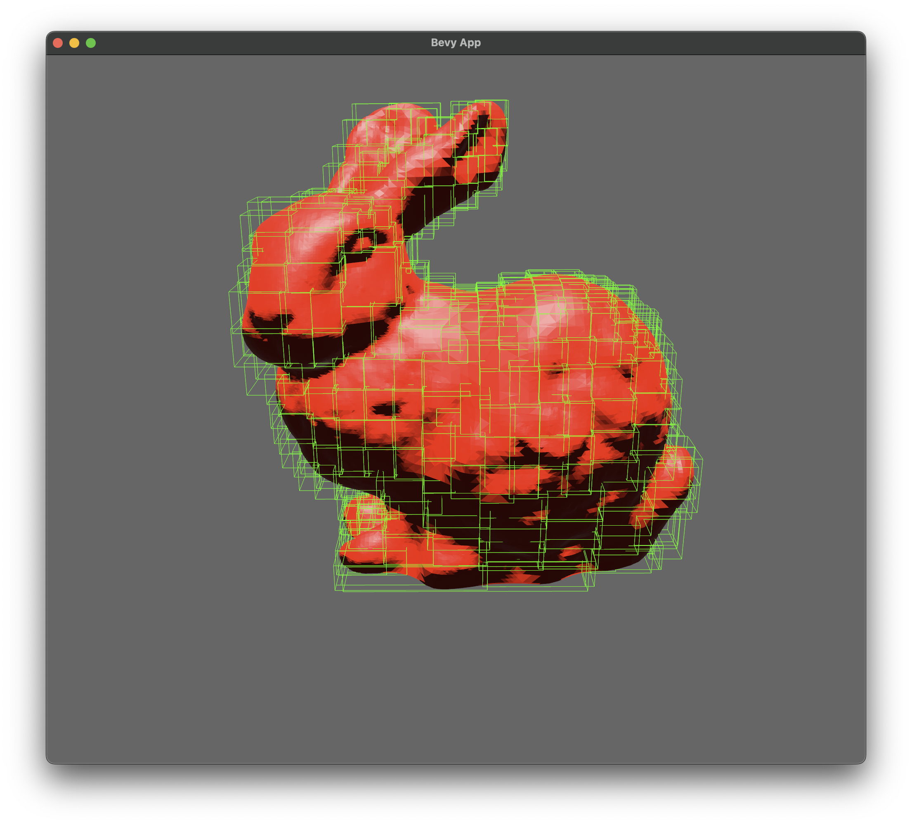
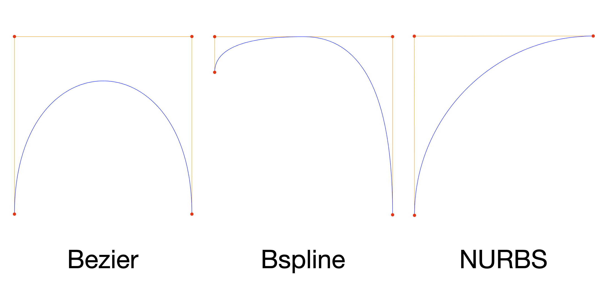
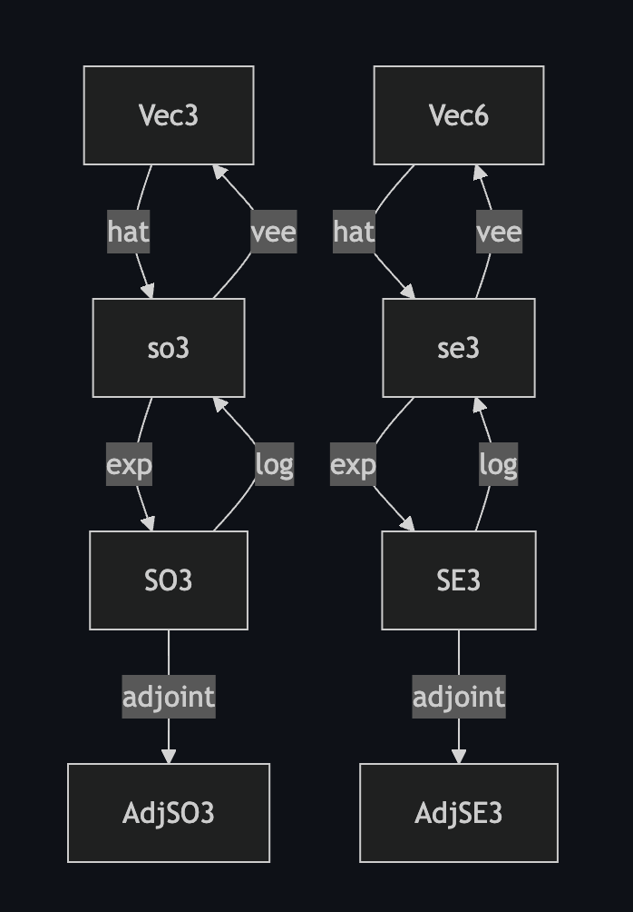
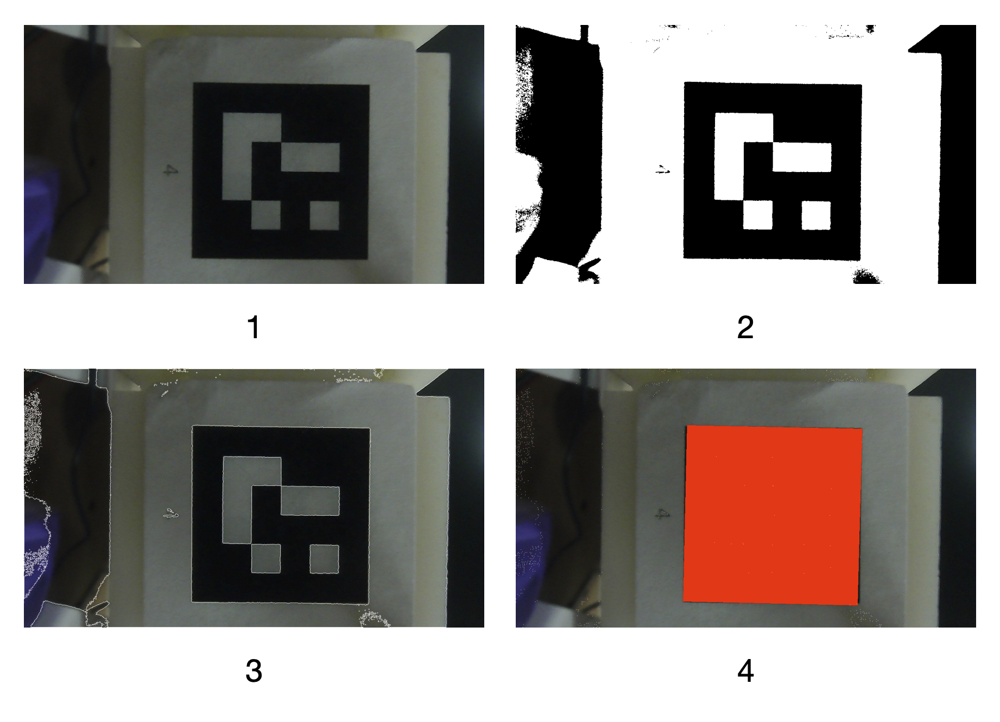
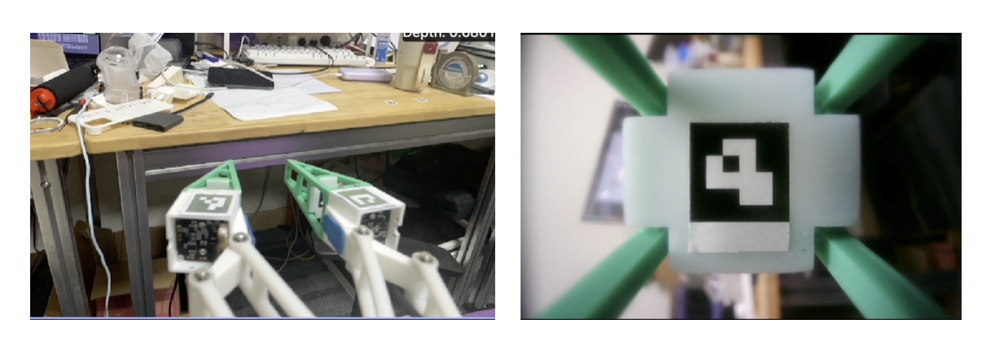
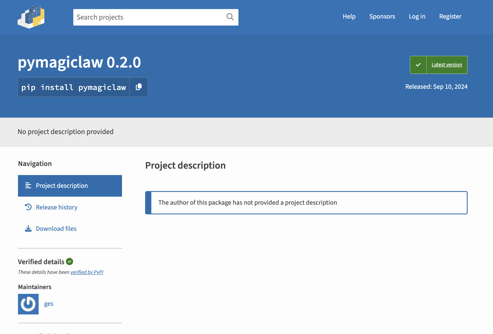
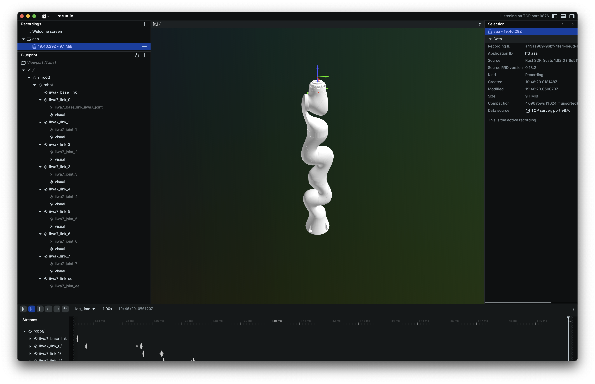

# 项目经历

## 协作机器人交互平台
<div style="display: flex;">
<video autoplay style="margin: 10px" src="b/pick.mp4" controls="controls" width="180" height="320"></video>
<video autoplay style="margin: 10px" src="b/ttt.mp4" controls="controls" width="180" height="320"></video>
<video autoplay style="margin: 10px" src="b/cali.mp4" controls="controls" width="180" height="320"></video>
<video autoplay style="margin: 10px" src="b/grasp.mp4" controls="controls" width="180" height="320"></video>
<video autoplay style="margin: 10px" src="b/sort.mp4" controls="controls" width="180" height="320"></video>
</div>

本项目使用Franka协作机器人、桌面投影、Realsense相机与ArUco识别块，实现了多种交互任务，包括拾取、井字棋、视觉校准、深度学习抓取、垃圾分拣等交互任务。

本项目使用python作为主语言实现了交互逻辑，使用c++编写了Franka机器人控制驱动程序，两者通过TCP网络通讯进行控制。在井字棋交互任务中，使用minimax算法构建了一个AI玩家与人类对弈。在深度学习抓取任务中，使用了抓取位置预测算法，实现了机器人的自动抓取。使用了OpenCV库实现了桌面投影，以及对ArUco的识别。

## Rust 3d Mesh 计算几何库


github: [https://github.com/geshengpsn/mesh](https://github.com/geshengpsn/mesh)

使用纯Rust实现了3d mesh的计算几何库，包括了顶点、边、面、体积、表面积、法向量、曲率、拓扑、几何变换、布尔操作、几何查询加速数据结构、CSG、文件读写等功能。本项目使用了Rust的泛型、trait等特性，实现了一个高效、安全、易用的3d mesh库。

## NURBS 曲线曲面库


```rust
fn main() {
    let curve = BezierCurve::new(vec![
        Vector2::new(0.0, 500.0),
        Vector2::new(0.0, 0.0),
        Vector2::new(500.0, 0.0),
        Vector2::new(500.0, 500.0),
    ]);
    to_svg("bezier", &curve);

    let curve = BsplineCurve::new_uniform(
        vec![
            Vector2::new(0.0, 100.0),
            Vector2::new(0.0, 0.0),
            Vector2::new(500.0, 0.0),
            Vector2::new(500.0, 500.0),
        ],
        2,
    );
    to_bspline_svg("bspline", &curve);

    let curve = NurbsCurve::new(
        vec![
            (Vector2::new(500.0, 0.0), 1.0),
            (Vector2::new(0.0, 0.0), 1.0),
            (Vector2::new(0.0, 500.0), 2.0),
        ],
        vec![0.0, 0.0, 0.0, 1.0, 1.0, 1.0],
        2,
    );
    to_nurbs_svg("nurbs", &curve);
}
```
github: [https://github.com/geshengpsn?tab=repositories](https://github.com/geshengpsn?tab=repositories)

使用Rust实现了参数曲线曲面库，包括了贝塞尔曲线曲面、B样条曲线曲面、NURBS曲线曲面等功能。本项目为各个参数曲线曲面实现了基于trait与范型的曲线曲面接口，使得用户可以使用不同的维度与不同的数学backend来实现曲线曲面的计算。

## 李群李代数计算开源库 - liealg


github: [https://github.com/geshengpsn/liealg](https://github.com/geshengpsn/liealg)

为机器人运动动力学库而专门实现的SO3与SE3群的李群李代数计算库。包含了李群李代数的基本算子，有李代数指数映射、对数映射、李群伴随矩阵等算子。算法程序经过充分测试与优化，证明了其正确性与高效性。程序主要使用Rust trait与范型特性实现了计算过程，使得代码具有高度的可复用性与可扩展性。

## Rust 机器人动力学运动学库
<video src="rust_ik.mov" controls="controls" width="980" height="735"></video>

github: [https://github.com/geshengpsn/kidy](https://github.com/geshengpsn/kidy)

online demo: [https://github.com/geshengpsn/online-robot-sim](https://github.com/geshengpsn/online-robot-sim)

实现了基于李群李代数系统的机器人动力学运动学库，包括了机器人的正逆运动学、雅可比矩阵、正逆动力学等功能。除此之外，还实现了网页端实时逆运动学交互界面，可以实时调整机器人的末端姿态，并查看机器人的关节角度。

## Rust ArUco 二维码识别库


github: [https://github.com/geshengpsn/aruco-rs](https://github.com/geshengpsn/aruco-rs)

在大多数机器人项目中，我们经常只使用OpenCV中ArUco码识别功能。但是苦于OpenCV过于臃肿导致的编译缓慢，本项目尝试使用纯Rust实现了一个独立的ArUco码识别库。该库实现了ArUco码的检测、id识别等功能，对于一张720p图片可以做到10ms以内的识别速度，并且编译速度大幅提升，内存占用、cpu占用率大幅降低。使之可以在其他Rust机器人视觉项目中脱离OpenCV，方便的使用ArUco码识别。

## Universl Ebodiment Interface 通用具身接口

项目旨在为具身智能的多模态数据采集与摇操提供一个通用的工具链、可扩展的开源数据与模型。具体来说就是首先使用手持硬件夹爪进行机器人操作数据采集与机器人摇操；采集的数据再进行可视化、编辑、标注、上传；使用共建的大数据集，通过模仿学习等方法，可以训练出性能更好的具身智能模型。通过使用本项目开发的机器人夹爪，可以直接将模型迁移到其他机器人上，实现跨具身智能平台的模型迁移。

<video autoplay style="margin: 10px" src="uei/data.mp4" controls="controls" width="960" height="540" ></video>

为了高效的收集机器人操作数据，我们设计实现了一种专用于收集数据的手持夹爪硬件，该硬件包含一个iphone手机、一个3D打印的夹爪以及一对柔性手指。通过使用使用手持夹爪硬件进行数据收集时共收集5种多模态数据，其分别为夹爪空间位姿、RGB图像、深度图像、夹爪开合角度、柔性手指触觉共5种模态。

### UEI - 基于视觉的柔性手指触觉



将相机模块安装在柔性手指内部，通过视觉识别柔性手指内部的ArUco码的6D位姿，获取柔性手指的部分形变信息。然后使用机器学习模型来将6D位姿信息映射为柔性手指的触觉信息。

柔性手指使用一个USB相机模块作为视觉传感器，使用树莓派5作为上位机来进行ArUco码识别与机器模型推理。相机使用v4l2接口获取相机图像，使用OpenCV库进行ArUco码识别，使用[Burn](https://burn.dev/)在树莓派5的CPU上进行机器学习模型推理。最后将推理结果通过WebSocket向外界发送。

## UEI - pymagiclaw 通用机器人操作控制库


github: [https://github.com/geshengpsn/pymagiclaw](https://github.com/geshengpsn/pymagiclaw)

开发并上传了一个通用的机器人操作控制库，本库使用python作为接口语言，内部使用rust语言实现。本库计划支持多种机器人本体以及机器人夹爪的统一API操作，现阶段只支持了Franka机器人本体以及UEI项目中设计的夹爪。使用此库可以控制机器人本体末端的绝对位姿与相对步进位姿，同时可以获取机器人的状态信息。也可以控制夹爪的标定以及开合。

```python
from time import sleep
from pymagiclaw import franka 
import numpy as np

# 输入ip，系统是否有实时内核
robot = franka.Franka("192.168.1.100", False)

# 设置机器人的阻抗控制参数
robot.start_control(300, 30)

# 机器人末端相对位姿控制
m = np.identity(4)
m[2, 3] = 0.1;
robot.move_relative_cartesian(m)

# 获取机器人末端位姿
state = robot.read_state()
print(state)
```
机器人控制代码

```python
from time import sleep
from pymagiclaw import gripper 

# 连接到gripper
g = gripper.Gripper("192.168.5.24")

# gripper标定
g.calibration()

# 连续发送指令
for _ in range(0, 100):
    sleep(0.033)
    g.pos(0.5)
```
夹爪控制代码

### UEI - 机器人摇操

<video autoplay style="margin: 10px" src="uei/teleop.mp4" controls="controls" width="960" height="540" ></video>

使用硬件夹爪实现了，franka 机器人的摇操功能，可以通过手持硬件夹爪来控制机器人的末端位姿与夹爪开合。使用了pymagiclaw库来实现机器人的控制。

## UEI - URDF 机器人模型文件解析库



使用Rust语言实现了URDF文件的解析，主要将URDF文件中的离散的link与joint转变为图数据结构，方便后续的机器人运动学、动力学计算。


## UEI - 基于rerun的多模态数据可视化（在线与离线）

<video autoplay src="visual.mov" controls="controls" width="960" height="540">
</video>

基于rerun工具的数据可视化，使用rust语言编写，使用了URDF文件解析库。可以实时或离线查看多模态数据，包括RGB图像、深度图像、点云、夹爪开合角度、柔性手指触觉等数据。
